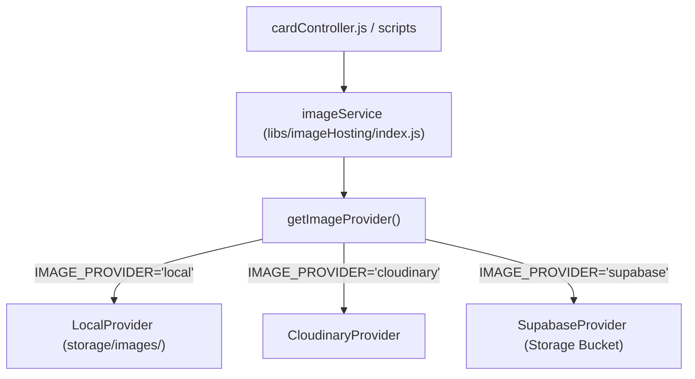

# 🖼️ Arquitectura: Proveedores de Alojamiento de Imágenes

Este documento describe la capa de abstracción para el almacenamiento y gestión de imágenes de cartas en **Smilbot**.

---

## 🎯 1. Patrón Provider / Factory
Para evitar el acoplamiento a un único servicio de almacenamiento en la nube, el backend implementa una clase base abstracta `ImageProvider` y un Factory `imageService` que selecciona el proveedor activo según la variable de entorno `IMAGE_PROVIDER`.



---

## ⚙️ 2. Proveedores Disponibles

### A. Local (`IMAGE_PROVIDER=local`)
* **Ubicación:** `storage/images/`
* **Exposición:** Servido estáticamente por Express en la ruta `/public/`.
* **Uso típico:** Desarrollo local y pruebas sin requerir servicios en la nube.

### B. Cloudinary (`IMAGE_PROVIDER=cloudinary`)
* **Variables requeridas en `.env`:**
  * `CLOUDINARY_CLOUD_NAME`
  * `CLOUDINARY_API_KEY`
  * `CLOUDINARY_API_SECRET`
* **Carpeta remota:** `smilbot/`

### C. Supabase Storage (`IMAGE_PROVIDER=supabase`)
* **Variables requeridas en `.env`:**
  * `SUPABASE_URL`
  * `SUPABASE_SERVICE_ROLE_KEY` o `SUPABASE_ANON_KEY`
  * `SUPABASE_BUCKET_NAME` (Default: `cards`)

---

## 💻 3. Interfaz de Uso (`imageService`)

```javascript
import { imageService } from '../libs/imageHosting/index.js'

// Subir una imagen (recibe el archivo de Multer)
const { url, publicId } = await imageService.upload(req.file)

// Eliminar una imagen remota por su publicId
await imageService.delete(card.imagePublicId)

// Obtener la URL pública a partir del publicId
const publicUrl = imageService.getUrl(card.imagePublicId)
```

---

## 🔄 4. Migración de Imágenes entre Proveedores
Existe un script en el repositorio para migrar masivamente las imágenes de un proveedor a otro:
```bash
node scripts/migrateImages.js --from=local --to=supabase
```
