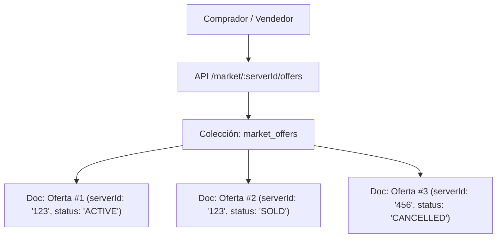
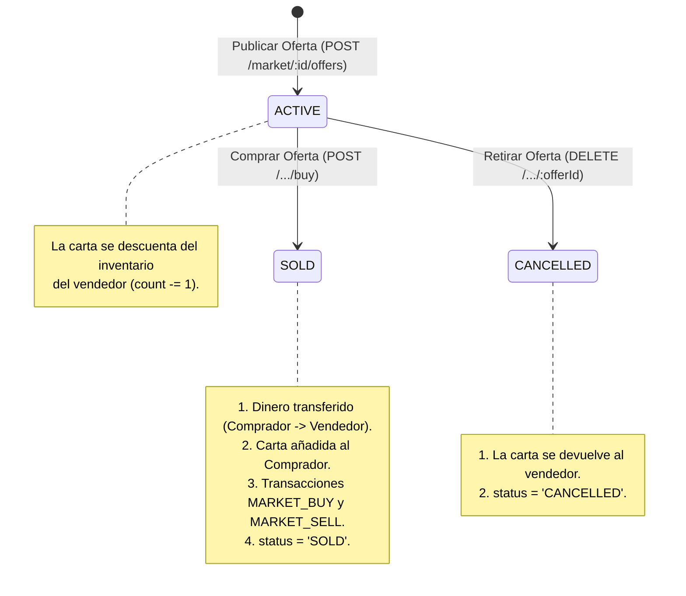

# 🛒 Feature: Mercado P2P por Servidor (Colección Independiente `MarketOffer`)

Este documento describe la especificación del sistema de **Mercado Peer-to-Peer (P2P)** por servidor en el backend de **Smilbot**, utilizando una **colección independiente de ofertas (`market_offers`)** para máxima escalabilidad y auditoría.

---

## 🎯 1. Concepto General y Arquitectura
Cada servidor de Discord (`marketId` / `serverId`) posee su propio mercado. En lugar de embeber miles de ofertas dentro de un solo documento del servidor (lo que colapsaría el límite de 16 MB de MongoDB), **cada oferta es un documento independiente en la colección `market_offers`**.



---

## 🗄️ 2. Modelo de Datos (`MarketOffer`)

```typescript
export type MarketOfferStatus = 'ACTIVE' | 'SOLD' | 'CANCELLED';

interface MarketOfferSchema {
  _id: ObjectId | string;
  serverId: string;                // ID del servidor de Discord (Guild ID)
  seller: ObjectId | string;       // Referencia a 'User' (vendedor)
  sellerDiscordId: string;         // DiscordId del vendedor
  cardId: ObjectId | string;       // Referencia a 'Card' puesta en venta
  price: number;                   // Precio pedido en monedas
  status: MarketOfferStatus;       // 'ACTIVE' | 'SOLD' | 'CANCELLED' (default: 'ACTIVE')
  
  // Metadatos de compra/cancelación
  buyer?: ObjectId | string | null;// Referencia a 'User' (comprador)
  buyerDiscordId?: string | null;  // DiscordId del comprador
  soldPrice?: number | null;       // Precio final de venta
  soldAt?: Date | null;            // Fecha de compra
  cancelledAt?: Date | null;       // Fecha de cancelación
  createdAt: Date;
  updatedAt: Date;
}
```

### ⚡ Índices de Alto Rendimiento
```javascript
marketOfferSchema.index({ serverId: 1, status: 1, createdAt: -1 })
marketOfferSchema.index({ seller: 1, status: 1 })
marketOfferSchema.index({ buyer: 1, status: 1 })
```

---

## ⚙️ 3. Ciclo de Vida de una Oferta



---

## 🌐 4. Endpoints del Mercado (`/market`)

### 1. Listar ofertas activas del servidor
* **GET** `/market/:marketId/offers?limit=20&page=1`
* **Consulta:** `MarketOffer.find({ serverId: req.params.marketId, status: 'ACTIVE' }).populate('cardId').populate('seller')`
* **Respuesta (200 OK):** Array de ofertas activas.

### 2. Publicar una oferta
* **POST** `/market/:marketId/offers`
* **Body:**
  ```json
  {
    "discordId": "123456789012345678",
    "username": "Vendedor",
    "cardName": "Smil Legendario",
    "price": 500
  }
  ```
* **Efecto:** Valida que el usuario tenga la carta (`count > 0`), la descuenta de su inventario y crea el documento `MarketOffer` en estado `ACTIVE`.

### 3. Comprar una oferta
* **POST** `/market/:marketId/offers/:offerId/buy`
* **Body:**
  ```json
  {
    "discordId": "987654321098765432",
    "username": "Comprador"
  }
  ```
* **Validaciones:**
  * Oferta en estado `ACTIVE`.
  * `buyer._id !== offer.seller`.
  * `buyer.balance >= offer.price`.
* **Efecto:**
  1. Descuenta saldo al comprador y suma la carta a su inventario.
  2. Suma saldo y `totalCoinsEarned` al vendedor.
  3. Marca `status: 'SOLD'`, `buyer`, `buyerDiscordId`, `soldPrice`, `soldAt`.
  4. Genera transacciones `MARKET_BUY` y `MARKET_SELL` en el Ledger.

### 4. Cancelar / Retirar una oferta
* **DELETE** `/market/:marketId/offers/:offerId`
* **Body:**
  ```json
  {
    "discordId": "123456789012345678",
    "username": "Vendedor"
  }
  ```
* **Validaciones:** Solo el vendedor propietario puede cancelar.
* **Efecto:** Marca `status: 'CANCELLED'`, `cancelledAt: new Date()` y devuelve la carta al vendedor (`addCard`).

---

## 🔄 5. Estrategia de Migración
El script `scripts/backfillStatsAndLedger.js` extrae cualquier oferta existente en los arrays embebidos de `markets` y las inserta como documentos independientes en `market_offers` sin duplicados.
