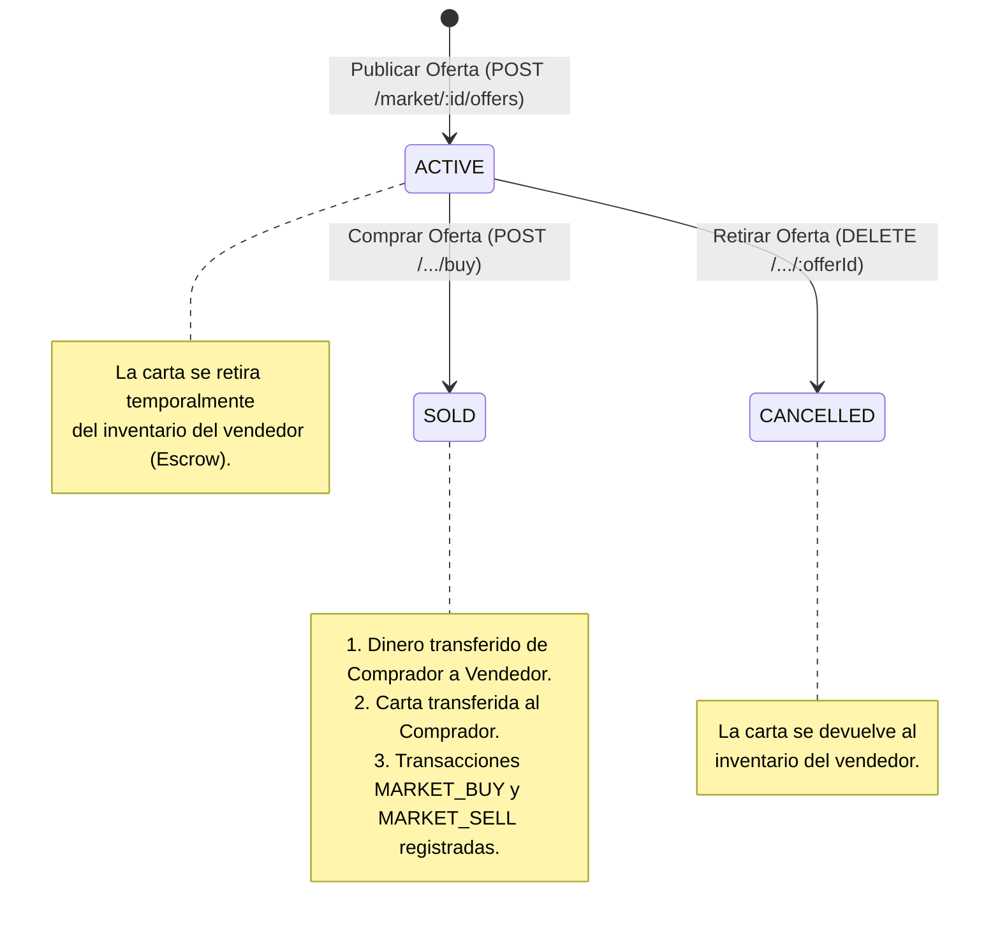

# 🛒 Feature: Mercado P2P por Servidor

Este documento describe la especificación del sistema de **Mercado Peer-to-Peer (P2P)** por servidor en el backend de **Smilbot**.

---

## 🎯 1. Concepto General
Cada servidor de Discord (`marketId` / `serverId`) posee su propio mercado independiente. Los usuarios pueden poner a la venta cartas de su inventario fijando un precio en monedas. Otros usuarios del mismo servidor pueden comprar esas ofertas.

---

## 🗄️ 2. Modelo de Datos (`Market` y `MarketOffer`)

```typescript
export type MarketOfferStatus = 'ACTIVE' | 'SOLD' | 'CANCELLED';

interface MarketOfferSchema {
  _id: ObjectId | string;
  cardId: ObjectId | string;       // Carta puesta en venta
  price: number;                   // Precio pedido en monedas
  seller: ObjectId | string;       // ID de usuario vendedor
  buyer?: ObjectId | string | null;// ID de usuario comprador
  buyerDiscordId?: string | null;  // DiscordId del comprador
  soldPrice?: number | null;       // Precio final de venta
  soldAt?: Date | null;            // Fecha de compra
  cancelledAt?: Date | null;       // Fecha de cancelación
  status: MarketOfferStatus;       // 'ACTIVE' | 'SOLD' | 'CANCELLED'
  active: boolean;                 // true mientras status === 'ACTIVE'
  createdAt: Date;
  updatedAt: Date;
}

interface MarketSchema {
  _id: ObjectId | string;
  discordId: string;               // ID del servidor de Discord (Guild ID)
  offers: MarketOfferSchema[];     // Colección embebida de ofertas
  createdAt: Date;
  updatedAt: Date;
}
```

---

## ⚙️ 3. Ciclo de Vida de una Oferta



---

## 🌐 4. Endpoints del Mercado (`/market`)

### 1. Listar ofertas activas del servidor
* **GET** `/market/:marketId/offers`
* **Comportamiento:** Devuelve solo las ofertas con `status === 'ACTIVE'`, incluyendo los datos poblados de la carta (`cardId`) y el vendedor (`seller`).

### 2. Publicar una oferta
* **POST** `/market/:marketId/offers`
* **Body:**
  ```json
  {
    "discordId": "123456789012345678",
    "username": "Vendedor",
    "cardName": "Smil Legendario",
    "price": 500
  }
  ```
* **Efecto:** Busca la carta en el inventario del usuario, la retira y crea la oferta en estado `ACTIVE`.

### 3. Comprar una oferta
* **POST** `/market/:marketId/offers/:offerId/buy`
* **Body:**
  ```json
  {
    "discordId": "987654321098765432",
    "username": "Comprador"
  }
  ```
* **Validaciones:**
  * La oferta debe estar `ACTIVE`.
  * El comprador no puede ser el mismo vendedor.
  * El comprador debe tener `balance >= offer.price`.
* **Efecto:** Realiza la transferencia de fondos y carta, cambia el estado a `SOLD` y registra ambas transacciones en el Ledger.

### 4. Cancelar / Retirar una oferta
* **DELETE** `/market/:marketId/offers/:offerId`
* **Body:**
  ```json
  {
    "discordId": "123456789012345678",
    "username": "Vendedor"
  }
  ```
* **Validaciones:** Solo el vendedor original puede cancelar su oferta.
* **Efecto:** Cambia el estado a `CANCELLED` y devuelve la carta al inventario del vendedor.
